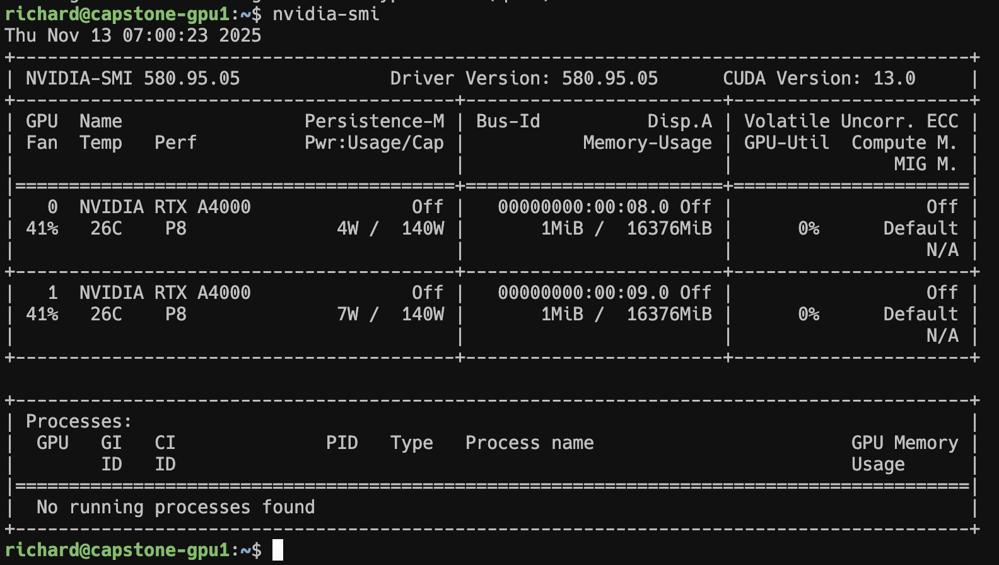
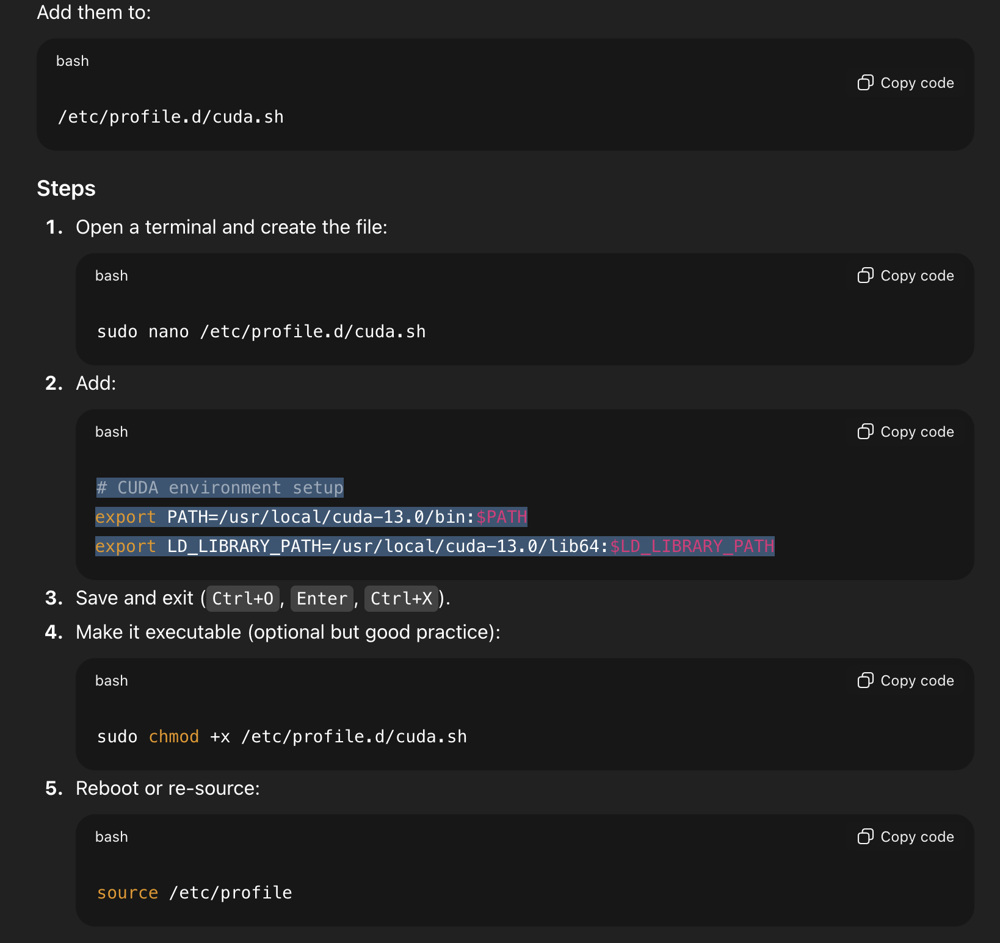

# GPU Drivers, CUDA Toolkit & LocalAGI Setup

> Converted from `GPU Drivers CUDA tool kit LocalAGI.docx`


GPU Drivers and CUDA tool kit


Repaired drivers and installed CUDA 13 using the following outline process





Did the following so that the cuda-tools are available to users when they login




Additional software installed

```bash
apt-get install nvtop (shows GPU usage, graphically, nice and useful tool)
```


Docker install

Followed the official guide as per the following


```bash
Once installed if you get the following error you need to be added to the docker group in /etc/group. Once added you need to log out and log back in.
```


```bash
richard@capstone-gpu1:~$ docker ps
permission denied while trying to connect to the docker API at unix:///var/run/docker.sock
```


```bash
added the docker proxy config per the document “docker with proxy” (in markup link to the document)
```


then installed the nvidia-container toolkit per the instructins from Nvidia.


# Add the NVIDIA container toolkit repo

distribution=$(. /etc/os-release; echo $ID$VERSION_ID)


```bash
curl -fsSL https://nvidia.github.io/libnvidia-container/gpgkey \
```

| sudo gpg --dearmor -o /usr/share/keyrings/nvidia-container-toolkit-keyring.gpg


```bash
curl -s -L https://nvidia.github.io/libnvidia-container/$distribution/libnvidia-container.list \
```

| sed 's#deb https://#deb [signed-by=/usr/share/keyrings/nvidia-container-toolkit-keyring.gpg] https://#' \

| sudo tee /etc/apt/sources.list.d/nvidia-container-toolkit.list


```bash
sudo apt-get update
sudo apt-get install -y nvidia-container-toolkit
```


```bash
Then configure docker to use it
sudo nvidia-ctk runtime configure --runtime=docker
sudo systemctl restart docker
```


localAGI Install


```bash
git clone
```


added a

```bash
docker-compose.local.yaml
services:
```

localagi:

image: localai/localagi:latest

container_name: localagi

restart: unless-stopped

# Internal only — not exposed to host

expose:

- "8080"

environment:

## - Tz=Utc

# optional volumes:

# volumes:

#   - ./models:/app/models

networks:

- internal

build:

context: .

```bash
dockerfile: Dockerfile.webui
```

args:

## Http_Proxy: ${Http_Proxy}

## Https_Proxy: ${Https_Proxy}

## No_Proxy: ${No_Proxy}


nginx:

image: nginx:latest

container_name: localagi-proxy

restart: unless-stopped

depends_on:

- localagi

ports:

- "80:80"

- "443:443"

volumes:

- ./nginx/conf.d:/etc/nginx/conf.d:ro

- ./nginx/.htpasswd:/etc/nginx/.htpasswd:ro

# - ./certs:/etc/letsencrypt:ro  # optional if using HTTPS

networks:

- internal

- public


networks:

internal:

internal: true

public:

driver: bridge


nginx config

In the LocalAGI folder that was created with the git clone create the following hierarchy.

./nginix

./nginix/conf.d


put the following file localagi.conf in ./nginx/conf.d/


localagi.conf

##############################

## #   Upstream Definitions     #

##############################


upstream localagi_upstream {

server localagi:3000;

}


upstream localai_upstream {

server localai:8080;

}


upstream localrecall_upstream {

server localrecall:8080;

}


###############################################

# 9000 — LocalAGI WEB UI (REQUIRE BASIC AUTH) #

###############################################

server {

listen 9000;

server_name _;


auth_basic "LocalAGI Web UI";

auth_basic_user_file /etc/nginx/.htpasswd;


location / {

proxy_pass http://localagi_upstream;

proxy_set_header Host              $host;

proxy_set_header X-Real-IP         $remote_addr;

proxy_set_header X-Forwarded-For   $proxy_add_x_forwarded_for;

proxy_set_header X-Forwarded-Proto $scheme;

proxy_buffering off;

}

}


###############################################

# 9001 — Localrecall (REQUIRE BASIC AUTH) #

###############################################

server {

listen 9080;

server_name _;


auth_basic "Localrecall Web UI";

auth_basic_user_file /etc/nginx/.htpasswd;


location / {

proxy_pass http://localrecall_upstream;

proxy_set_header Host              $host;

proxy_set_header X-Real-IP         $remote_addr;

proxy_set_header X-Forwarded-For   $proxy_add_x_forwarded_for;

proxy_set_header X-Forwarded-Proto $scheme;

proxy_buffering off;

}

}


###############################################################

# 80 — LocalAI API + UI                                    #

# BASIC AUTH for WEB UI ONLY                                #

# NO BASIC AUTH for /v1/* (OpenAI API — token required)     #

###############################################################

server {

listen 80;

server_name _;


###############################################################

# SECTION 1 — OpenAI API (/v1/*) — TOKEN ONLY, NO BASIC AUTH #

###############################################################

location /v1/ {

# NO basic auth here — scripts authenticate via Bearer token

proxy_pass http://localai_upstream;


proxy_set_header Host              $host;

proxy_set_header X-Real-IP         $remote_addr;

proxy_set_header X-Forwarded-For   $proxy_add_x_forwarded_for;

proxy_set_header X-Forwarded-Proto $scheme;

proxy_buffering off;

}


#####################################################

# SECTION 2 — LocalAI WEB CONSOLE — BASIC AUTH REQ  #

#####################################################

location / {

auth_basic "LocalAI Web Console";

auth_basic_user_file /etc/nginx/.htpasswd;


proxy_pass http://localai_upstream;


proxy_set_header Host              $host;

proxy_set_header X-Real-IP         $remote_addr;

proxy_set_header X-Forwarded-For   $proxy_add_x_forwarded_for;

proxy_set_header X-Forwarded-Proto $scheme;

proxy_buffering off;

}

}

htpasswd file

The purpose of the .htpasswd file is to secure the administrative portals of the following applications

Localai

Localrecall

localagi.


And in ./nginix create admin users in the .htpasswd file. These are users who need to have permission to create/modify the configuration of the services.  Use the following command to add a user


htpasswd .htpasswd username


make sure that the file has permissions 644

LocalAGI Configuration

```bash
Due to the nature of the deakin environment there are a number of configuration steps required to setup LocalAGI so that it works properly and can reach various external sites for docker images, models and docker builds.
```

Docker.webui

This file needs to be updated to support the Deakin Proxy configuration.

------------

# Use Bun container for building the React UI

```dockerfile
FROM oven/bun:1 AS ui-builder
```

## Arg Http_Proxy

## Arg Https_Proxy

## Arg No_Proxy

```bash
ENV http_proxy=$HTTP_PROXY
ENV https_proxy=$HTTPS_PROXY
ENV no_proxy=$NO_PROXY
```


# Set the working directory for the React UI

WORKDIR /app


# Copy package.json and bun.lockb (if exists)

COPY webui/react-ui/package.json webui/react-ui/bun.lockb* ./


# Install dependencies

```bash
RUN bun install --frozen-lockfile
```


# Copy the rest of the React UI source code

COPY webui/react-ui/ ./


# Build the React UI

```bash
RUN bun run build
```


# Use a temporary build image based on Golang 1.24-alpine

```dockerfile
FROM golang:1.24-alpine AS builder
```

## Arg Http_Proxy

## Arg Https_Proxy

## Arg No_Proxy

```bash
ENV http_proxy=$HTTP_PROXY
ENV https_proxy=$HTTPS_PROXY
ENV no_proxy=$NO_PROXY
```


# Define argument for linker flags

ARG LDFLAGS="-s -w"


# Install git

```bash
RUN apk add --no-cache git
RUN rm -rf /tmp/* /var/cache/apk/*
```


# Set the working directory

WORKDIR /work


# Copy go.mod and go.sum files first to leverage Docker cache

COPY go.mod go.sum ./


# Download dependencies - this layer will be cached as long as go.mod and go.sum don't change

```bash
RUN go mod download
```


# Now copy the rest of the source code

## Copy . .


# Copy the built React UI from the ui-builder stage

COPY --from=ui-builder /app/dist /work/webui/react-ui/dist


# Build the application

```bash
RUN CGO_ENABLED=0 go build -ldflags="$LDFLAGS" -o localagi ./
```


```dockerfile
FROM ubuntu:24.04
```

## Arg Http_Proxy

## Arg Https_Proxy

## Arg No_Proxy

```bash
ENV http_proxy=$HTTP_PROXY
ENV https_proxy=$HTTPS_PROXY
ENV no_proxy=$NO_PROXY
```


```bash
ENV DEBIAN_FRONTEND=noninteractive
```


# Install runtime dependencies

```bash
RUN apt-get update && apt-get install -y \
```

ca-certificates \

tzdata \

```bash
docker.io \
```

bash \

wget \

curl


# Copy the webui binary from the builder stage to the final image

COPY --from=builder /work/localagi /localagi


# Define the command that will be run when the container is started

ENTRYPOINT ["/localagi"]

Docker-compose.nvidia.yaml

.env

HTTP_PROXY=http://proxy1.it.deakin.edu.au:3128

HTTPS_PROXY=http://proxy1.it.deakin.edu.au:3128

NO_PROXY=localhost,127.0.0.1


Added /etc/profile.d/proxy.sh

export HTTP_PROXY=http://proxy1.it.deakin.edu.au:3128

export HTTPS_PROXY=http://proxy1.it.deakin.edu.au:3128

export NO_PROXY="localhost,127.0.0.1,::1"


Setting up so that you can connect to the OpenAI API via Token Auth but still have basic auth for the admin pannels


Generate an API_TOKEN


```bash
openssl rand -hex 32
```


sk-a07de3d7880e0b602068b3eb58fb784b808b724278aa775bac66953c11b3c4ff


