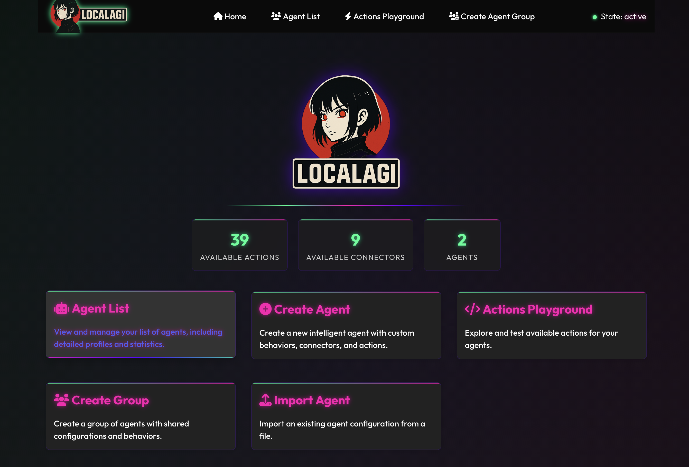
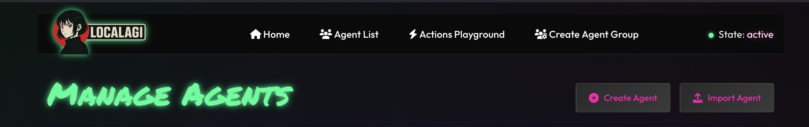
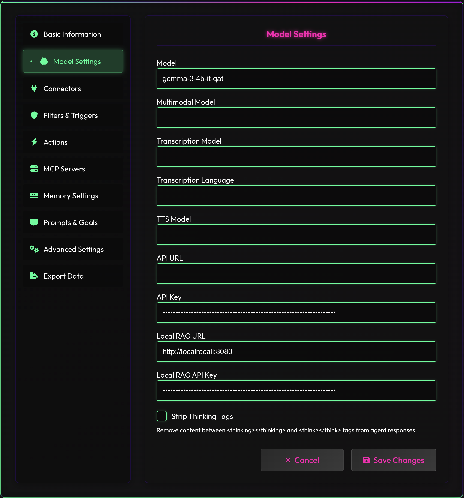
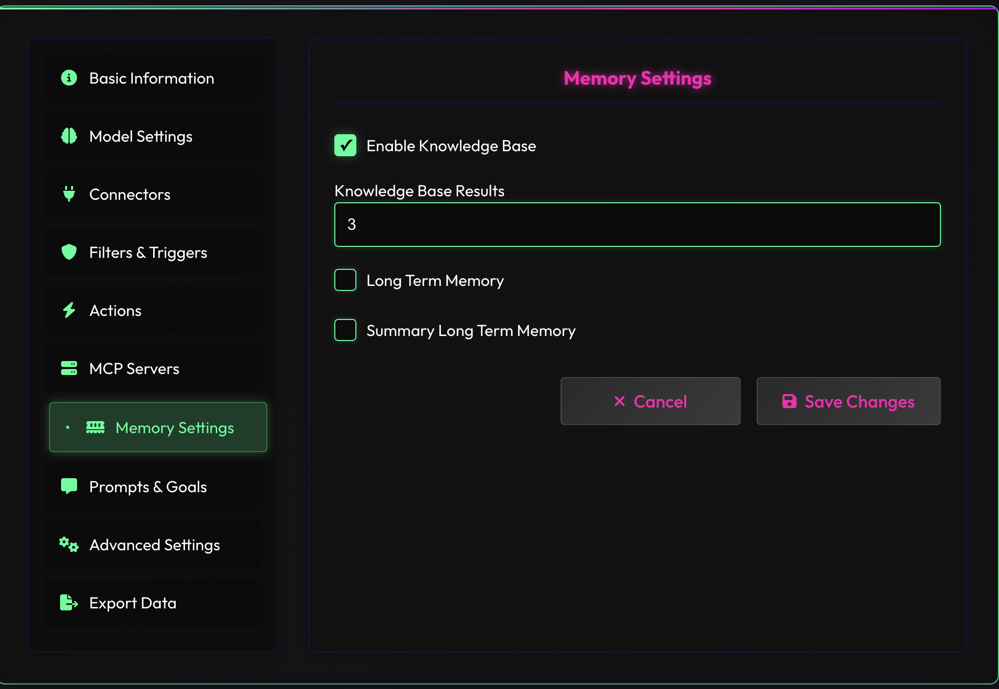
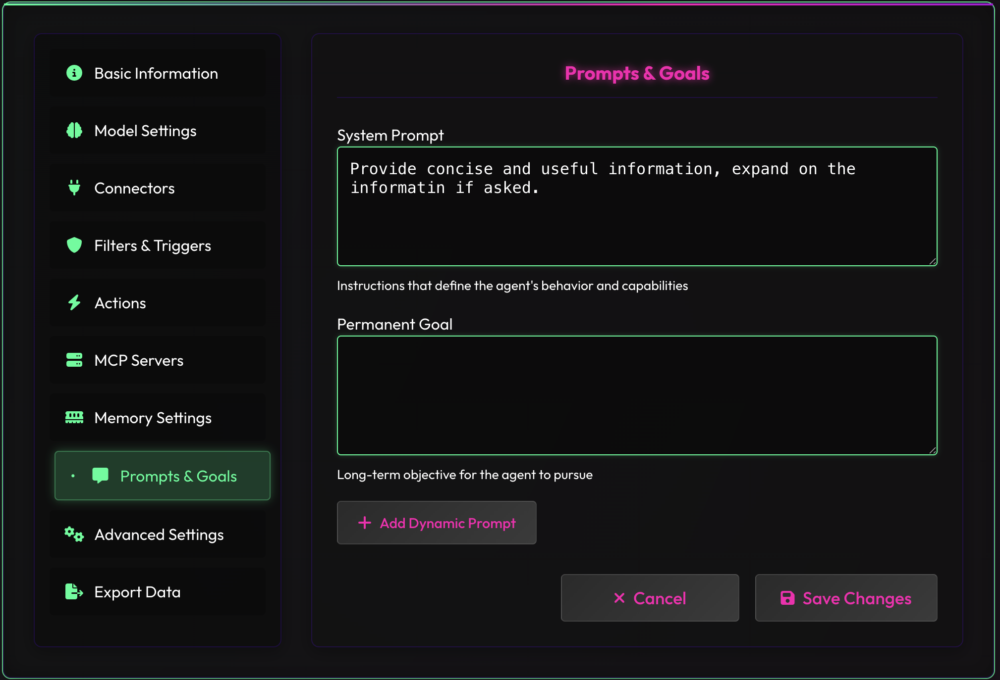
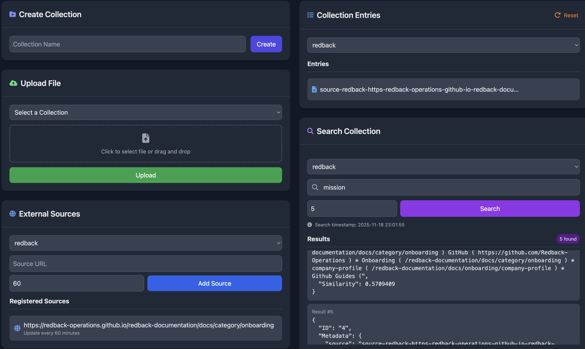
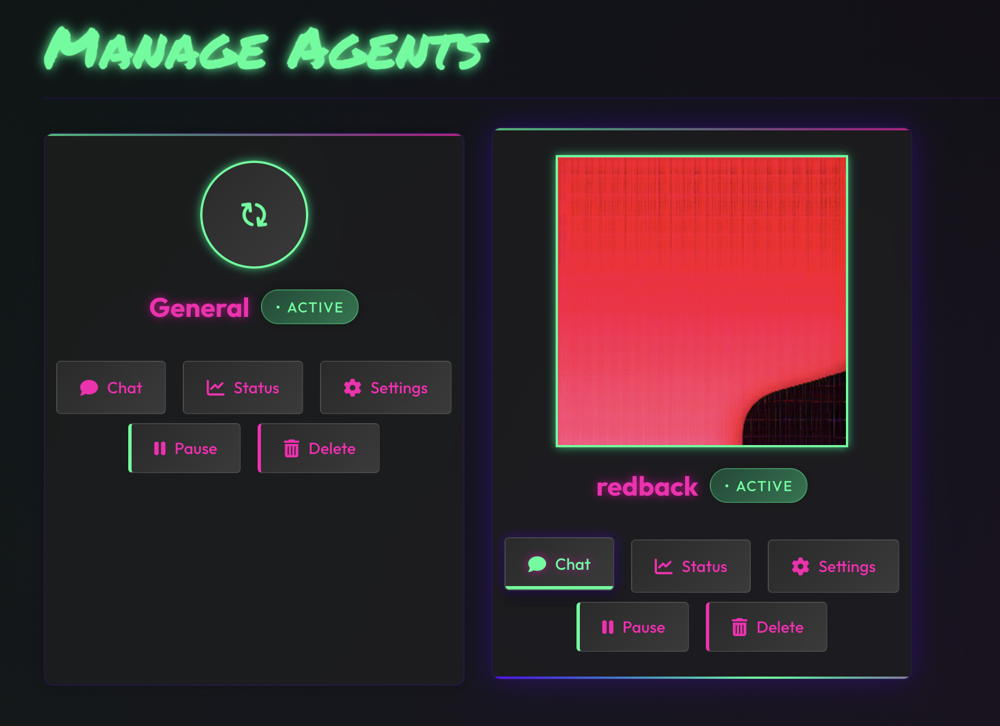
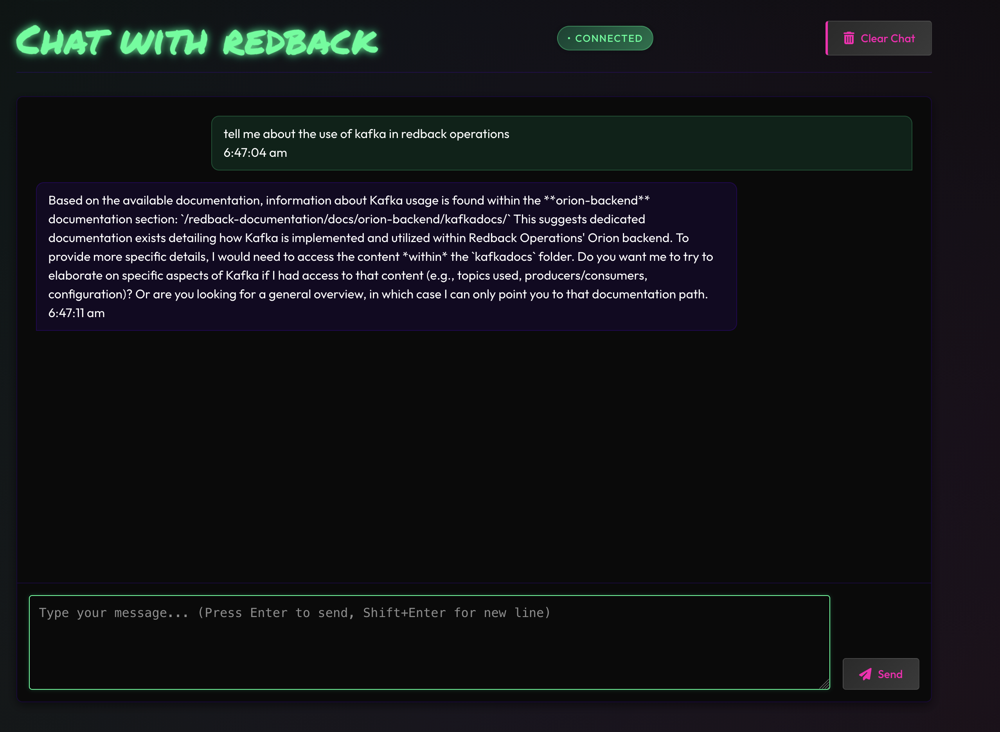

# LocalAGI Agent – RedBack Query

> Converted from `LocalAGI Agent RedBack Query.docx`

The following is a proof of concept configuration of a LocalAGI Agent to facilitate the ability to ask questions about the redback onboarding document.


Agent Configuration for Redback Chat


Connect to


Select Agent List




And then Create agent




Complete details as follows





For the API keys use the API key that was created for LocalAI. In the original install it was done as follows:


```bash
openssl rand -hex 32
```


```bash
sk-SOMESECRET
```




This enables the use of localrecall for RAG.





The following shows the Localrecall setup


You can connect to Localrecall via





It is now possible to chat with the agent per the following








